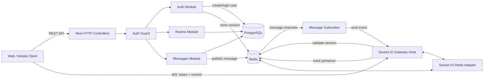

# Anonymous-chat-api Architecture

## Overview

Anonymous-chat-api is a NestJS-based chat backend built around three core subsystems:

- HTTP APIs for auth, users, rooms, and message persistence.
- A Socket.IO gateway for real-time room presence and message delivery.
- Shared Redis and PostgreSQL infrastructure for session state, presence tracking, and durable chat storage.

The main design goal is to keep the HTTP layer stateless while using Redis as the shared coordination layer for both session lookup and cross-instance message fan-out.

## Architecture Diagram

## Component Flow

### HTTP path

1. A client calls the auth endpoint.
2. `AuthService` looks up the user in PostgreSQL and creates the user if it does not exist.
3. The service signs a JWT with the user id and username.
4. The signed token is stored in Redis under `session:<token>` with a 24-hour TTL.
5. Later HTTP requests can use the JWT for authorization, and WebSocket connections use the Redis-backed session to confirm that the token is still valid.

### WebSocket path

1. A client connects to the `/chat` namespace and sends `token` and `roomId` in the handshake query.
2. `ChatGateway` looks up `session:<token>` in Redis.
3. If the session exists, the socket joins the requested room.
4. The user name is added to the room presence set in Redis: `room:<roomId>:users`.
5. The gateway emits the current room member list and notifies the room that a user joined.

### Message persistence and fan-out

1. `MessagesService.createMessage()` inserts the message into PostgreSQL.
2. The saved message is reloaded with its user relation and normalized into the payload the client expects.
3. That payload is published to Redis on `room:<roomId>:messages`.
4. `MessageSubscriber` subscribes to `room:*:messages` and forwards each event to the local Socket.IO server as `message:new`.

## Session Strategy

Session handling is intentionally simple:

- The JWT is generated in `AuthService.login()` using the Nest JWT module.
- The token contains only the user id and username; it is not used as the source of truth for authorization by itself.
- Redis stores a session record keyed by the token string, which makes the JWT act as both the client credential and the lookup key.
- The Redis record uses a fixed 24-hour TTL.
- JWT expiry is controlled by `JWT_EXPIRES_IN` in `jwt.config.ts`.

Practical result:

- If the JWT expires first, the client must re-authenticate.
- If the Redis session expires first, the token may still decode, but the WebSocket handshake will be rejected because the session lookup fails.
- There is no refresh-token flow or sliding session renewal in the current implementation.

## Redis Pub/Sub and WebSocket Fan-out

Redis is used in two different ways:

- `RedisService.pub` publishes room messages into Redis channels.
- `RedisService.sub` subscribes to wildcard room channels and relays those messages to Socket.IO clients.

This gives the system a clean broadcast path across multiple app instances:

- Instance A persists a message and publishes it to Redis.
- Every running instance receives the Redis pub/sub event through its subscriber.
- Each instance emits the event to the sockets it currently hosts for that room.

This is the right pattern for horizontal scaling because Socket.IO rooms themselves are local to one process unless a shared adapter is installed. The repository includes a Redis adapter helper in `src/websocket/redis.adapter.ts`, which is the correct mechanism for making Socket.IO room operations cluster-aware.

Important implementation note: the adapter helper exists, but it is not currently wired into gateway startup in this codebase. That means Redis pub/sub already handles message fan-out, but Socket.IO room state itself still needs the adapter to behave correctly across multiple instances.

## Estimated Capacity on One Instance

On a small production-grade instance, I would estimate roughly:

- About 1,000 to 2,000 mostly-idle concurrent WebSocket connections.
- About 100 to 300 actively chatting users at once before latency starts to become noticeable.

Reasoning:

- Socket.IO connection overhead is moderate, but still manageable for thousands of idle sockets in a single Node.js process.
- The heavier costs are Redis round-trips during connect/disconnect and PostgreSQL writes on message creation.
- The current implementation does not batch writes, queue messages, or cache room metadata beyond Redis sets, so throughput is limited more by chat activity than by raw connection count.
- The exact number depends heavily on instance size, database latency, Redis latency, and message frequency, so this should be treated as an estimate rather than a guarantee.

## Scaling to 10x Load

To support roughly 10 times the current load, I would change the system in this order:

1. Run multiple NestJS instances behind a load balancer that supports WebSockets.
2. Wire the Socket.IO Redis adapter into startup so room membership and emits are cluster-aware.
3. Separate the HTTP API and WebSocket gateway into independent deployment units if traffic patterns diverge.
4. Add PostgreSQL indexes for the hot access patterns, especially by `roomId`, `createdAt`, and any foreign-key lookups used by message listing.
5. Introduce a queue or worker layer for message persistence if write bursts become the bottleneck.
6. Add rate limiting and connection throttling to reduce abuse and reconnect storms.
7. Use observability metrics for socket count, Redis latency, publish fan-out time, and message insert time.

## Known Limitations and Trade-offs

- Sessions are duplicated between JWT and Redis, which simplifies WebSocket validation but adds extra state to maintain.
- The Redis session key uses the token string directly, so token rotation or revocation requires explicit session invalidation logic.
- WebSocket authentication uses query parameters, which is convenient but exposes the token more broadly than an Authorization header would.
- Presence is stored as a Redis set, so abnormal disconnects can leave stale room membership until cleanup runs.
- The current code does not implement refresh tokens, offline delivery, message acknowledgements, or replay protection.
- `origin: '*'` is permissive for development, but it is too open for a locked-down production deployment.
- The Redis adapter helper is present but still needs to be wired into startup before the WebSocket layer is truly cluster-safe.

## Deployment URL

Live application URL: not currently available in this workspace.

If you deploy Anonymous-chat-api to Render or another platform, place the public URL here so the architecture document stays complete.
